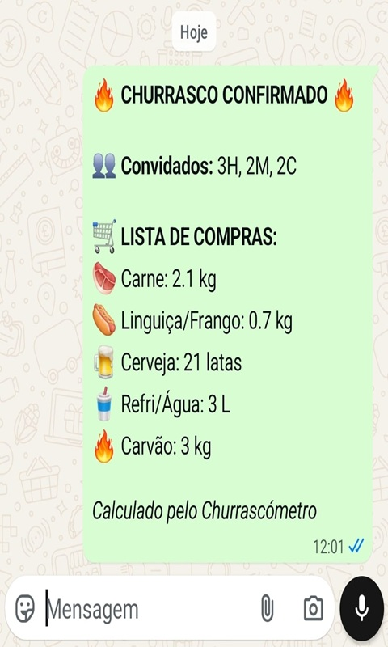
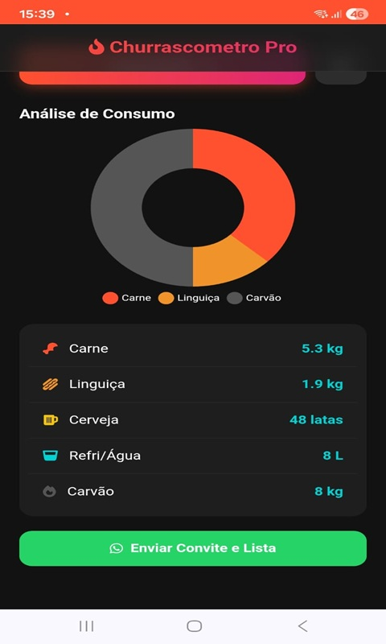

# 🥩 Churrascómetro Pro


-lightgrey)

> Uma Aplicação Web Progressiva (PWA) moderna para calcular a quantidade exata de comida e bebida para o seu churrasco, evitando desperdícios e falta de suprimentos.

---

## 📱 Demonstração

🔗 **Acesse online agora:** [https://churrascometro.vercel.app](https://churrascometro.vercel.app)

---

## 📸 Screenshots

| Tela Inicial | Resultados & Gráfico | Compartilhamento |
|:---:|:---:|:---:|
|  |  |  |

---

## 🛠️ Tecnologias Utilizadas

Este projeto foi desenvolvido com foco em **Performance**, **Usabilidade (UX)** e **Código Limpo**, sem dependência de frameworks pesados.

* **Front-end:** HTML5 Semântico, CSS3 (Flexbox/Grid), JavaScript (Vanilla ES6+).
* **Visualização de Dados:** [Chart.js](https://www.chartjs.org/) para o gráfico dinâmico de consumo.
* **Mobile:** Tecnologia PWA (Progressive Web App) com Service Workers e Web Manifest para instalação nativa no Android e iOS.
* **Persistência de Dados:** Uso da LocalStorage API para salvar as configurações do usuário no navegador.
* **Deploy:** CI/CD automatizado via Vercel.

---

## ✨ Funcionalidades

* ✅ **Cálculo Inteligente:** Algoritmo que considera perfis de consumo médios diferentes para Homens, Mulheres e Crianças.
* ✅ **Visualização Gráfica:** Gráfico de rosca (Doughnut Chart) para visualizar a proporção entre carnes e carvão.
* ✅ **App Instalável:** Funciona como um aplicativo nativo (tela cheia, ícone na home) graças à tecnologia PWA.
* ✅ **Compartilhamento via WhatsApp:** Gera uma lista de compras formatada com emojis e envia diretamente com um clique.
* ✅ **Persistência:** O app "lembra" da última contagem inserida mesmo se o usuário fechar e reabrir.
* ✅ **Design Responsivo e Dark Mode:** Interface moderna otimizada para qualquer tamanho de tela (Mobile First).

---

## 🚀 Como rodar o projeto localmente

1.  **Clone o repositório**
    ```bash
    git clone [https://github.com/rafaelrsc7/Churrascometro.git](https://github.com/rafaelrsc7/Churrascometro.git)
    ```
2.  **Abra a pasta do projeto**
    ```bash
    cd Churrascometro
    ```
3.  **Rode o servidor**
    * Como é um projeto estático (HTML/JS), você precisa de um servidor local simples para que os recursos do PWA funcionem corretamente.
    * Se usar o VS Code, instale a extensão "Live Server", clique com o botão direito no `index.html` e escolha "Open with Live Server".

---

## 🤝 Autor

Desenvolvido por **Rafael Santos Cruz**

[](https://www.linkedin.com/in/rafaelsantoscruz)
[](https://github.com/rafaelrsc7)

---

⚠️ *Este é um projeto de estudo e portfólio.*
